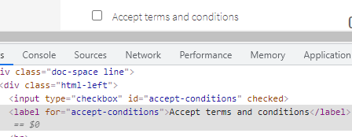
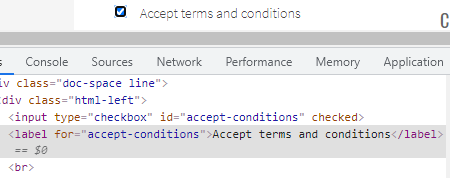
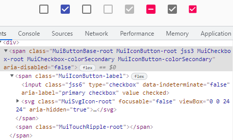
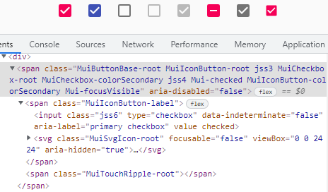
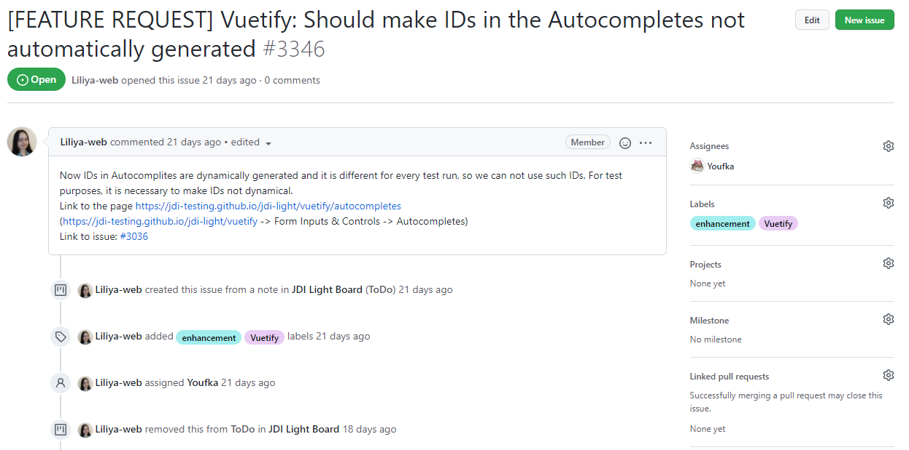
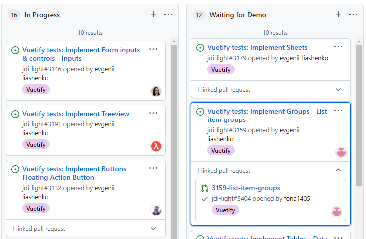
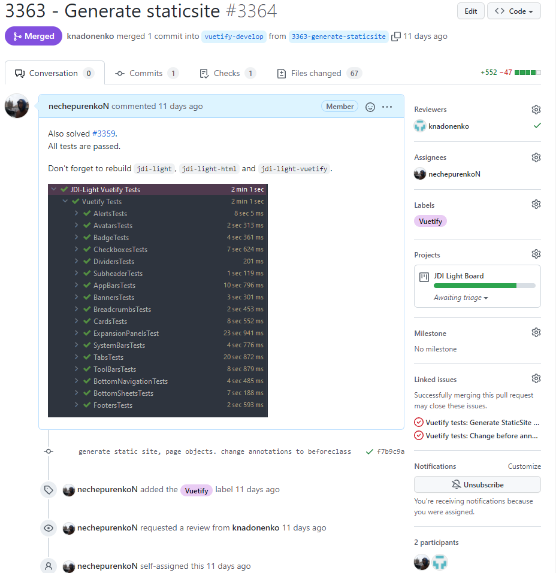
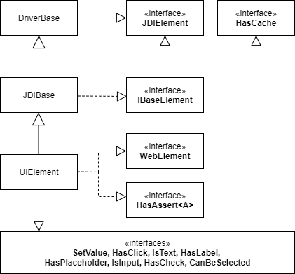
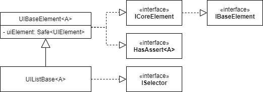

# Введение

Данная статья предназначена прежде всего для тех, кто занимается поддержкой JDI Light. К сожалению, на момент написания
этого материала существует мало информации для мэйнтейнеров, а не конечных пользователей. Автоматизаторы приходят и
уходят, знания не передаются. Из-за этого многие проблемы решаются по несколько раз и разными способами, а пул реквесты
в мастер собирают сотни комментариев, релизы задерживаются.

Местами могут быть ошибки/опечатки и неформальный язык, так удобнее начать. Когда этот материал будет закончен, возможно
частично, и прорецензирован ведущими разработчиками, возможен перевод на английский.

# Оглавление

TODO

# Что не используется

В модулях `material-ui`, `vuetify-js` и др. многие фичи JDI Light не используются/игнорируются. Этот раздел
динамический, что-то будет добавляться/удаляться по мере ревью работ.

Изложенное здесь описано в документации, но не все ее внимательно читают.

Перечитайте, пожалуйста, документацию к JDI Light еще раз. Возможно, вы найдете полезную для мэйнтейнеров информацию или
фичи, которые есть в JDI, но не используются/переписываются еще раз в вашем модуле.

## Локаторы

### Использование не UI аннотаций

Если элемент содержит уникальный текст, то можно воспользоваться аннотациями
`@ByText("example")` и `@WithText("example")`, которые эквивалентны аннотациям с
локаторами `".//*/text()[normalize-space(.) = %s]/parent::*"` и
`".//*/text()[contains(normalize-space(.), %s)]/parent::*"`. Возможно, это повысит читаемость вашего кода.

Пожалуйста, изучите список существующих аннотацией
[по ссылке](https://jdi-docs.github.io/jdi-light/#custom-smart-annotations).

### Возможности аннотации UI

Аннотация `@UI` позволяет нам комбинировать *css* и *xpath* локаторы вместе. В случае с *css* нет возможности, например,
поиска по тексту, но, зачастую, с помощью
*css* селекторов можно удобно ограничить область поиска. При переходе от *css* к *xpath* локатор может раздуться. JDI
позволяет использовать преимущества обоих подходов, например:

*Xpath*: `"//div[contains(@class,'btn')]//*[text()='Submit']"`

*JDI locator*: `div.btn['Submit']`

Больше интересных примеров использования 
[**здесь**](https://jdi-docs.github.io/jdi-light/#jdi-locators-as-simple-as-css-as-powerful-as-xpath). 
Пожалуйста, изучите этот абзац, возможно, это сэкономит вам время.

# Поддержка фрэймворков

Полезная (или не очень) информация для разработчиков, имплементирующих кастомные элементы для поддержки различных
фрэймворков: **material-ui**, **vuetify-js** и других.

## Описание задачи

В настоящее время существует множество различных HTML/CSS/JS фреймворков, например,
[**bootstrap**](https://bootstrap5.ru/) или [**W3.css**](https://www.w3schools.com/w3css/default.asp). Они предоставляют
собой некоторый набор переопределенных стилей для основных элементов страницы. Помимо визуального оформления, фрэймворк
может предложить собственный способ организации элементов (некоторые правила верстки), так и собственные javascript
обработчики.

Кастомные элементы/стили/обработчики могут не сохранять/нарушать некоторые стандартные инварианты элементов. Рассмотрим
реализацию `checkbox`, соответствующую стандарту *HTML 5* и реализацию в фрэймворке *material-ui*.

HTML5:

| Unchecked | Checked |
| --- | --- |
|  |  |

В инспекторе нет никаких изменений. Встроенная в JDI Light проверка выглядит следующим образом:

```java
    protected boolean selected() {
        if (getWebElement().isSelected())
            return true;
        return hasClass("checked") || hasClass("active") ||
            hasClass("selected") || attr("checked").equals("true");
    }
```

и она корректно работает для приведенного элемента.

Рассмотрим checkbox в *material-ui*.

Material UI:

| Unchecked | Checked |
| --- | --- |
|  |  |

В данном случае стандартная проверка работает не так, как мы ожидаем, выдавая ошибку первого рода. Необходимо
использовать кастомную проверку.

Можно заметить, что к элементу добавляется класс `Mui-checked`, наличие которого можно использовать при проверке.

**Q. Будет ли такая проверка стабильной?**

**A. Необходимо изучить документацию фрэймворка и проверить гарантии, написав набор тестов.**

И кстати, не забывайте, что иногда полезло использовать `&& super.isSmth()` или `|| super.isSmth()`, 
чтобы сохранить инварианты.

## С чего начать

### Задачи

Задачи оформляются с помощью [**issue**](https://github.com/jdi-testing/jdi-light/issues).



В ней обычно приводится краткое описание задачи, шаги для решения, ссылка на epic (более глобальная задача), ссылки на
пул реквесты или комментарии. Если вы не можете разобраться с формулировкой задачи, проконсультируйтесь с тимлидом.

Статус задачи можно посмотреть на [**доске**](https://github.com/orgs/jdi-testing/projects/1). Пожалуйста, **не
забывайте обновлять** статус задач (In progress, Waiting for demo).



Задачи можно фильтровать по лэйблу, на рисунке выше выбраны задачи, относящиеся к фрэймворку **vuetify**.

### Стратегия ветвления и оформление пул реквестов

У каждого модуля для поддержки фрэймворка есть **рабочая ветка**, например, `master_material_ui` или `vuetify-develop`.
При выполнении задачи создавайте ветку для нее **из рабочей**.

Правило именование ветки следующее: **[issue-number]-[issue-short-description]**. Пример: 3134-implement-cards,
3281-fix-unused-imports.

Таким образом, всегда можно найти ветку(-и), где происходит разработка. Ваши коллеги могут сделать fetch ветки (IDE
подскажет, когда вы наберете номер issue) и помочь вам в случае проблем/вопросов.

Когда вы закончите выполнение задачи, создайте пул реквест **в рабочую ветку** (не в мастер).

Рассмотрим пример оформления пул реквеста



Обратите внимание на название реквеста -- оно должно быть осмысленным. В комментарии желательно описать, что вы сделали,
какие проблемы решили или просто оставить информацию, которую важно знать коллегам/ревьюверу.

Добавьте в *reviewers* **LightReviewTeam**, либо вашего тимлида **(важно!)**.

Сделайте *assign* на себя. Если для вашей задачи предусмотрен *label* -- добавьте его, так будет проще фильтровать пул
реквесты.

Укажите в *projects* доску (см. выше).

Укажите в *linked issues* задачу(-и), которую вы решили.

В совокупности это позволит привязать задачу, пул реквест, ветку к доске и получить результат на рисунке выше.

Пожалуйста, придерживайтесь этих правил.

### Работа с документацией

TODO

Перечитайте 
[**гайд**](https://epam-my.sharepoint.com/:w:/p/evgenii_liashenko/Ef5Y3JcicTlPtMmtHg_19T8BLDZqSkBEa7oOgyDxq_hgUA?e=TUcIPI)
для новоприбывших коллег. Пока он не полностью сюда перенесен.

## Реализация кастомных элементов

### Когда нужны или не нужны кастомные элементы

Как "правило большого пальца" используйте следующий чек-лист:

- **Не имплементировать** элементы вида **секции** (неопределенного количества и состава элементов). Можно сделать
  type-alias, если считаете это нужным.
- Имплементируем **значимые** для пользователя элементы.
- Если подобный элемент уже есть в html elements наследуемся от этого элемента.
  **Не изобретайте велосипед**. Переопредление возможно в случаях если реализация элемента во фрэймворке значительно
  отличается и не может быть (совсем или корректно) покрыта существующими решениями.
- Имплементируем элементы по возможности **просто**. Элемент должен быть **переиспользуемым**, не покрывайте слишком
  узкоспециализированную логику.
- В элементах не может быть айдишников или **специфичных для тестового случая** данных.
  **Исключение**: данные, гарантированные фреймворком. Например, в документации указано, что какой-то элемент всегда
  имеет определенный класс.
- **В библиотеке** не может быть **частных случаев** с нашего тестового сайта. Это тестовая верстка, она может повторять
  верстку элементов из документации, но это не дает никаких гарантий (см. выше).

Если у вас есть сомнения - проконсультируйтесь с тимлидом или с человеком, создавшим задачу.

Когда вы создайте класс для элемента, пожалуйста, **указывайте ссылку** на страницу с документацией. Пример:

```java
/**
 * To see an example of Badge web element please visit https://vuetifyjs.com/en/components/badges/
 */
public class Badge extends UIBaseElement<BadgeAssert> {
```

### Написание элемента

Перед написанием собственного элемента необходимо ответить на следующие вопросы:

- **Нужно ли** реализовывать элемент? Чем отличаются существующие решения и **насколько это критично**. (см. п. "Когда
  нужны или не нужны кастомные элементы")
- Определить **тип** элемента: *common*, *complex* или *composite*. Типы описаны в документации [**
  здесь**](https://jdi-docs.github.io/jdi-light/?java#ui-elements-on-contact-form).
- Определить **семантику** элемента: самостоятельный элемент, список или другое. От этого зависит расширяемый класс,
  скорее всего это будут `UIBaseElement<A>` или `UIListBase<A>`. Подробнее они описаны в разделах ниже.
- Выбрать используемые интерфейсы для расширения функционала.
- Определить, подойдут ли **стандартные ассерты**, либо нужно писать **кастомный**. Подробнее при ассерты в разделах
  ниже.

### Обзор UIElement и его иерархии

Иерархия базовых элементов JDI имеет следующий вид:



Скорее всего вам не придется изменять этот код, но неплохо будет понимать, за что отвечает каждый класс и интерфейс.

#### Интерфейс JDIElement

Нужен для получения имени элемента для использования в глобальной Map.

#### Класс DriverBase

Позволяет получить экземпляр драйвера с помощью `driver()`, `JavascriptExecutor` с помощью `js()`.
Предоставляет возможность работать с именем элемента, его родительскими элементами.

Класс `WebPage` не отмечен на диаграмме классов, так как не относится к `UIElement`.
`WebPage` расширяет `DriverBase`.

#### Интерфейс IBaseElement

Позволяет работать с таймаутами, кэшем и предоставляет интерфейс инициализации элемента, имплементирующего его.

#### Класс JDIBase

Определяет правила поиска элемента, работы с локаторами.
Хранит в себе кэш-обертку с `WebElement` и некоторую дополнительную информацию.

#### Интерфейс WebElement

Селениумовский интерфейс, ни больше ни меньше.

#### Интерфейс HasAssert\<A>

Позволяет получить Assertion object элемента.
Дженерик тип `A` нужен для понижающего приведения, подробнее о дженериках в следующих разделах.

Интерфейс предоставляет несколько alias-методов, для повышения читаемости кода.

```java
/**
 * Created by Roman Iovlev on 14.02.2018
 * Email: roman.iovlev.jdi@gmail.com; Skype: roman.iovlev
 */
public interface HasAssert<A> {
    A is();
    default A assertThat() {
        return is();
    }
    default A has() {
        return is();
    }
    default A waitFor() {
        return is();
    }
    default A waitFor(int sec) {
        ((IBaseElement)this).waitSec(sec);
        return is();
    }
    default A shouldBe() {
        return is();
    }
    default A verify() {
        assertSoft(); return is();
    }
}
```

#### Другие интерфейсы
На диаграмме представлен список интерфейсов, которые имплементирует `UIElement`.
Эти методы позволяет расширить базовый функционал `WebElement`, например,
кликнуть по определенной области, получить текст внутри, установить значение.

#### Класс UIElement
Реализует несколько конструкторов, проксирует методы `WebElement`,
добавляет специфичные методы, вроде `dragAndDropTo`, позволяет искать элементы внутри себя,
получать атрибуты, css-стили, выполнять различные проверки.

Многофункциональный класс, возможности которого покрывают большинство задач автоматизации.


### Обзор UIBaseElement и прикладных классов

**Q. Если `UIElement` такой мощный, почему я не могу наследовать его для своих элементов?**

**A. Для реализации кастомных элементов необходимо использовать паттерн ограничения интерфейса.**

Использование селениумовского `WebElement` позволяет одинаково работать со всеми элементами на странице,
предоставляя единообразный интерфейс.
Это не всегда хорошо, потому что некоторые элементы могут отличаться по своей семантике и не поддерживать то или иное
действие.

Пусть у вас на странице есть кнопка. Кнопку можно кликнуть, но нельзя вписать внутрь текст, как в текстовый input.
Наличие типизированных элементов JDI Light позволяет явным образом разграничить функционал.

Для реализации кастомных элементов скорее всего будет достаточно расширить классы
`UIBaseElement` или `UIListBase`, которые содержат в себе экземпляр, 
вернее `ThreadLocal` подобную обертку над `UIElement`.
Использование `UIElement` не напрямую, а через `ThreadLocal` переменную позволяет описать *pageobject* со статик элементом
внутри и не переживать за запуск теста в многопоточной среде.
Даже если тестовый класс будет распараллелен по методам и несколько браузеров будут работать на одной странице с одним
и тем же элементом, в конечном итоге вся логика взаимодействия между вашим кодом и браузером будет проходить через
`UIElement`, который у каждого потока (читай драйвера) будет свой.



Таким образом, по умолчанию элемент будет ограничен стандартным набором методов, применимых ко всем элементам.

#### Интерфейс ICoreElement
Позволяет добавить к кастомному элементу общие для всех элементов методы:
```java
public interface ICoreElement extends IBaseElement {
    UIElement core();
    default UIElement iCore() { return core(); }
    ...
    default void hover() { iCore().hover(); }
    default boolean isEnabled() { return iCore().isEnabled(); }
    default boolean isDisplayed() { return iCore().isDisplayed(); }
    default boolean isVisible() { return iCore().isVisible(); }
    default boolean isExist() { return iCore().isExist(); }
    ...
    default String attr(String name) { return iCore().attr(name); }
    default MapArray<String, String> attrs() { return iCore().attrs(); }
    default String css(String prop) { return iCore().css(prop); }
    default boolean hasClass(String className) { return iCore().hasClass(className); }
    default boolean hasAttribute(String attrName) { return iCore().hasAttribute(attrName); }
    default String printHtml() { return iCore().printHtml(); }
    default List<String> classes() { return iCore().classes(); }
    default UIElement find(@MarkupLocator String by) { return iCore().find(by); }
    ...
```

А также добавляет методы `IBaseElement`, рассмотренного выше.

#### Расширение функционала элемента

В `UIBaseElement` переопределен метод `core()`, возвращающий `UIElement` из этой обертки. Благодаря этому встроенные
интерфейсы с `default` методами могут обращаться к экземпляру и использовать реализацию из `UIElement`.
Таким образом, если вашему элементу надо добавить существующий в `UIElement` функционал, то достаточно будет добавить
интерфейс в объявление вашего класса, ничего больше делать не нужно.

Рассмотрим пример.
Пусть необходимо реализовать input, хотим, чтобы у пользователя была возможность передать в него данные, которые попадут
в input на странице.
У `UIElement` есть метод, позволяющий выполнить эту задачу, но отправка текста -- действие специфическое, не во все элементы 
можно послать текст, поэтому необходимо добавить соответствующий интерфейс.

```java
public class Input extends UIBaseElement<?> implements IsInput {
  ...
}
...
static Input inputObj;
inputObj.sendKeys("abacaba");
        ^
        |
  Получили из IsInput c default реализацией
```

Дефолтная реализация делает следующее:
```java
public interface IsInput extends IsText, HasPlaceholder {
    default void sendKeys(CharSequence... value) { core().sendKeys(value); }
```

Вызов `core()` возвращает `UIElement`, который вызывает `WebElement.sendKeys()`.

Список стандартных интерфейсов представлен в пакете `com.epam.jdi.light.elements.interfaces`.

#### Класс UIListBase\<A>

TODO

### Дженерики стандартных элементов

Стандартные классы `UIBaseElement`, `UIListBase`, `UIAssert` и другие используют дженерик параметры 
для понижающего приведения.

#### Понижающее приведение

Пусть у нас есть класс `Animal` и класс `Cat extends Animal`, тогда пример понижающего приведения представлен ниже.
```java
Animal cat = new Cat();
Cat theRealCat = (Cat) cat;
```

Если бы `cat` был создан с `new Animal()`, то мы бы получили в последствии `ClassCastException`.

Хотя понижающее приведение и считается критиками признаком плохого дизайна, нарушением LSP и другими
смертными грехами, эта практика позволяет писать достаточно обобщенный код и использовать его в иерархии наследования.

#### Как это работает в JDI Light

С одной стороны у нас есть элемент, реализующий `HasAssert<A>`.
Здесь `A` -- тип Assertion object'а, такими образом запись
```java
public class Avatar extends UIBaseElement<AvatarAssert> {
...
```
говорит о том, что Assertion object будет иметь тип `AvatarAssert`, обобщенный код попытается сделать понижающее
приведение именно к этому типу.

**Важно** переопределить метод **is()** иначе будет создан `UIAssert` и при попытке каста к указанному типу
вы получите `ClassCastException`.
```java
  public AvatarAssert is() {
        return new AvatarAssert().set(this);
  }
```

С другой стороны, есть Assertion object'ы, которые должны знать про 2 типа: свой тип для chain-вызовов вроде
`elem.is().smth().and().smwht();` и тип элемента, над которым происходит проверка, чтобы иметь возможность
вызывать его методы.

```java
public class AvatarAssert extends UIAssert<AvatarAssert, Avatar> {
```

Без понижающего приведения мы бы не могли использовать методы классов потомков `ICoreElement` и `UIAssert`.

Схематически это можно описать так (`ET` -- element type, `AT` -- assertion obj type):
```java
class ET extends UIBaseElement<AT> {...}
class AT extends UIAssert<AT, ET>
element.is() ~> (AT) assertionObj;
assertionObj.element() ~> (ET) element;
assertionObj.[any]() ~> (AT) assertionObj;
```

Притом, что в реализации классов родителей и `element`, и `assertionObj` могут иметь другие типы, благодаря понижающему
приведению мы можем использовать методы наших классов, а логику взаимодействия и реализации по умолчанию 
родительских.

### Написание complex элемента со своими аннотациями

При разработке *complex* элемента, состоящего из нескольких частей, может потребоваться знать больше,
чем 1 локатор.
В этом случае необходимо дать возможность конечному пользователю указать дополнительные локаторы, например,
с помощью кастомной аннотации.
При этом важно реализовать интерфейс `ISetup`, чтобы получить указанные локаторы внутри вашего класса.

Аннотация:
```java
@Retention(RetentionPolicy.RUNTIME)
@Target({ElementType.TYPE, ElementType.FIELD})
public @interface JDISomething {
    @MarkupLocator String root() default "";
    @MarkupLocator String inner() default "";
    @MarkupLocator String expand() default "";
    ...
}
```

Класс:
```java
public class CoolComplexElement extends UIBaseElement<?> implements ISetup {
  protected String ROOT_LOCATOR = ".v-root";
  protected String INNER_LOCATOR = ".v-inner__something-else";
  ...
  
  @Override
    public void setup(Field field) {
        super.setup(field);
        if (!fieldHasAnnotation(field, JDIButtonGroup.class, CoolComplexElement.class))
            return;
        JDISomething annotation = field.getAnnotation(JDISomething.class);

        if (!annotation.root().isEmpty()) {
            ...
        }
        if (!annotation.inner().isEmpty()) {
            INNER_LOCATOR = annotation.inner();
        }
        ...
    }

}
```

### Частые ошибки

#### Написание конструктора элемента

Не создавайте конструктор для своих элементов.
Особенно если это public конструктор по умолчанию, который зачем-то прописывают явно.

Скорее всего ваша проблема решается либо методом `setCore`, либо с помощью реализации `ISetup`.
Первый устанавливает `UIElement`, т.е. де-факто сам элемент, второй -- позволяет получить информацию о поле (аннотацию)
и проинициализировать нужные поля.

#### Нарушение инварианта дуальных методов

Некоторые методы проверки состояния объекта, например `isDisplayed` и `isHidden`, формально говоря, образуют
[**полную группу событий**](https://ru.wikipedia.org/wiki/%D0%9F%D0%BE%D0%BB%D0%BD%D0%B0%D1%8F_%D0%B3%D1%80%D1%83%D0%BF%D0%BF%D0%B0_%D1%81%D0%BE%D0%B1%D1%8B%D1%82%D0%B8%D0%B9).
Говоря по-простому, элемент либо показан, либо спрятан. 
Одновременно эти методы не могут возвращать одинаковый результат.
В реализации по умолчанию эти методы сохраняют этот инвариант с помощью булевского отрицания (ведь всего 2 состояния).
```java
public interface ICoreElement extends IBaseElement {
    UIElement core();
    ...
    @JDIAction(value = "Check that '{name}' is displayed", timeout = 0)
    default boolean isDisplayed() { return iCore().isDisplayed(); }
    ...
    @JDIAction(value = "Check that '{name}' is hidden", timeout = 0)
    default boolean isHidden() { return !isDisplayed(); }
    ...
```

Представим такую ситуацию: для какого-то элемента фрэймворк добавляет классы `fwk-displayed` и `fwk-hidden`.
Тогда следующая реализация кастомного элемента некорректна:
```java
public class CoolElement extends UIBaseElement<?> {
  ...
  @Override
  public boolean isDisplayed() { return hasClass("fwk-displayed"); }
  ...
  @Override
  public boolean isHidden() { return hasClass("fwk-enabled"); }
  ...
}
```

Если у элемента вдруг не будет ни одного из перечисленных классов, то эти проверки окажутся некорректными.

Скорее всего, будет достаточно переопределить только 1 из проверок и добавить проверку по умолчанию 
`&& super.isSmth()` или `|| super.isSmth()`, в зависимости от строгости условия.

#### Написание уже существующего метода с другим именем

Пожалуйста, изучите список стандартных методов `UIElement` и связанных интерфейсов.
Не надо создавать метод `isNotDisplayed`, из `ICoreElement` вы получаете пару методов `isDisplayed` и `isHidden`.
Причем, если вы измените условие `isDisplayed`, то `isHidden` переопределять не придется -- метод вернет отрицание
переопределенного вами метода.

Перед написанием своих методов, особенно проверок, проверьте список уже существующих решений и, при необходимости,
переопределяйте их.

#### Использование лишних вызовов/переменных

При реализации внутренней логики иногда присутствует избыточность, например
```java
this.core().click();
```
вместо
```java
click();
```

Будьте внимательны, многие методы вызовутся у `core()` с помощью дефолтной реализации, писать это явно не нужно.

# Краткий обзор магии JDI

Некоторые особенности внутреннего устройства JDI, которые дадут вам поверхностное понимание того, что происходит под
капотом.

Цель раздела -- мотивировать вас не бояться использовать JDI, потому что это действительно крутой фрэймворк.

Сей раздел есть результат моего субъективного изучения кода и может содержать как неточности, так и серьезные
фактические ошибки. Если вы заметили оное, пожалуйста, исправьте.

## Зачем пересобирать модуль(-и)

При работе с JDI Light очень часто оказывается, что написанный вами код может не логировать определенные действия, не
дожидаться видимости элементов или вовсе падать со `StaleElementException`.

В этом разделе разберемся, как JDI Light позволяет избежать большинства ночных кошмаров/головных болей автоматизаторов и
причем тут пересборка проекта.

### Аспектно-ориентированное программирование

Чтобы понять как работают некоторые фичи JDI Light, необходимо разобраться с АОП. Основные понятия есть
[**на википедии**](https://ru.wikipedia.org/wiki/%D0%90%D1%81%D0%BF%D0%B5%D0%BA%D1%82%D0%BD%D0%BE-%D0%BE%D1%80%D0%B8%D0%B5%D0%BD%D1%82%D0%B8%D1%80%D0%BE%D0%B2%D0%B0%D0%BD%D0%BD%D0%BE%D0%B5_%D0%BF%D1%80%D0%BE%D0%B3%D1%80%D0%B0%D0%BC%D0%BC%D0%B8%D1%80%D0%BE%D0%B2%D0%B0%D0%BD%D0%B8%D0%B5), 
также есть несколько интересных статей на Хабре.

Аспектно-ориентированное программирование позволяет разделять бизнес-логику и некоторую "сопровождающую" логику.
Классические примеры: логирование, транзакционность, фильтрация и другие.

В нашем случае достаточно понимать следующее: мы можем **перехватывать** некоторые действия (например, вызовы методов на
элементе) **и выполнять** некоторый код (до, после, вместо).

Преимущество использования АОП заключается в том, что веб-элементы и "сопровождающая" логика находятся в разных частях и
практически не знают друг о друге. Это позволяет писать обобщенный и хорошо поддерживаемый код.

### Принципы реализации АОП

В основе АОП лежит паттерн проектирования [**прокси**](https://refactoring.guru/design-patterns/proxy). Существует
несколько способов реализации проксирования объектов и инструментов, позволяющих это сделать, остановимся на *AspectJ*.
Этот инструмент позволяет использовать несколько вариантов проксирования объектов: времени компиляции, времени
исполнения. Привожу выдержку [**из книги**](https://livebook.manning.com/book/aspectj-in-action-second-edition/chapter-8/3) по *AspectJ*:
> The most basic form of weaving is build-time source-code weaving, where the AspectJ compiler compiles source files to produce a woven system. Although this form offers the best experience by providing immediate feedback for source-code errors and by eliminating deployment modifications, using a new compiler can impede AOP adoption. One alternative is build-time byte-code weaving, which lets you delay the introduction of the special compiler until after you compile the code. It also offers a way to weave even when you don’t have access to the source code for classes or aspects. Load-time weaving goes further by eliminating the weaving step from the build process. Instead, it weaves classes as they’re loaded into the VM. Load-time weaving is often the first choice for AspectJ-based tools that want to add new functionality in a minimally invasive fashion. All these choices make adoption of AspectJ easier than ever before.

JDI Light использует компилятор *ajc*, позволяющий встраивать код аспектов в методы элементов (проксировать эти вызовы).
Вы можете заметить это по характерным логам при сборке модулей:

```
[INFO] --- aspectj-maven-plugin:1.12.6:compile (default) @ jdi-light-vuetify ---
[INFO] Showing AJC message detail for messages of types: [error, warning, fail]
[INFO] Join point 'method-call(boolean com.epam.jdi.light.vuetify.elements.complex.Autocomplete.isExpanded())' in Type 'com.epam.jdi.light.vuetify.asserts.AutocompleteAssert' (AutocompleteAssert.java:19) advised by around advice from 'com.epam.jdi.light.vuetify.actions.VuetifyActions' (VuetifyActions.java:31)
[INFO] Join point 'method-execution(com.epam.jdi.light.vuetify.asserts.AutocompleteAssert com.epam.jdi.light.vuetify.asserts.AutocompleteAssert.expanded())' in Type 'com.epam.jdi.light.vuetify.asserts.AutocompleteAssert' (AutocompleteAssert.java:16) advised by around advice from 'com.epam.jdi.light.vuetify.actions.VuetifyActions' (VuetifyActions.java:31)
[INFO] Join point 'method-call(boolean com.epam.jdi.light.vuetify.elements.complex.Autocomplete.isExpanded())' in Type 'com.epam.jdi.light.vuetify.asserts.AutocompleteAssert' (AutocompleteAssert.java:27) advised by around advice from 'com.epam.jdi.light.vuetify.actions.VuetifyActions' (VuetifyActions.java:31)
...
```

Таким образом, для поддержания работы логирования, ожидания и прочего, **необходимо перекомпилировать** тот модуль, в
который вы добавили свой кастомный класс.

Известна проблема, что дефолтные конфигурации запуска в IntelliJ Idea Community Edition (например когда запускаете код
через кнопку Play левее строк с кодом) игнорируют *ajc* и аспектный код не встраивается, что приводит к неправильному
поведению кода. Необходимо изучить проблему и обновить эту часть раздела.

### Аспекты в JDI Light

Рассмотрим пакет `com.epam.jdi.light.actions` в модуле JDI Light.

Условной "точкой входа" является `ActionProcessor`

```java
@Aspect
public class ActionProcessor {
    @Pointcut("within(com.epam.jdi.light..*) && @annotation(com.epam.jdi.light.common.JDIAction)")
    protected void jdiPointcut() {  }
    @Pointcut("execution(* *(..)) && @annotation(io.qameta.allure.Step)")
    protected void stepPointcut() {  }
    @Pointcut("execution(* *(..)) && @annotation(com.epam.jdi.light.common.JDebug)")
    protected void debugPointcut() {  }
    ...
}
```

Здесь видим 3 точки соединения, каждая имеет собственный скоуп. Условие внутри аннотации -- **pointcut designator**,
правила по которым выбираются методы для перехвата. Описание этих правил можно найти в интернете.

Рассмотрим `jdiPointcut`

```java
@Around("jdiPointcut()")
    public Object jdiAround(ProceedingJoinPoint jp) {
        String classMethod = "";
        try {
            classMethod = getJpClass(jp).getSimpleName() + "." + getMethodName(jp);
            logger.trace("<>@AO: " + classMethod);
        } catch (Exception ignore) { }
        ActionObject jInfo = newInfo(jp, "AO");
        failedMethods.clear();
        try {
            BEFORE_JDI_ACTION.execute(jInfo);
            Object result = isTop.get()
                ? stableAction(jInfo)
                : defaultAction(jInfo);
            logger.trace("<>@AO: %s >>> %s",classMethod, (result == null ? "NO RESULT" : result));
            AFTER_JDI_ACTION.execute(jInfo, result);
            return result;
        } catch (Throwable ex) {
            logger.debug("<>@AO exception:" + safeException(ex));
            throw ACTION_FAILED.execute(jInfo, ex);
        }
        finally {
            if (jInfo != null)
                jInfo.clear();
        }
    }
```

Метод `jdiAround` перехватит вызовы методов, аннотированные `@JDIAction`. Аргумент `ProceedingJoinPoint jp` -- содержит
информацию о вызове метода. С помощью utility-метода `newInfo` из `ActionHelper` получаем `ActionObject`, обертку над
перехваченными вызовами, позволяющую работать с `ProceedingJoinPoint` и `JoinPoint`, разница между которыми описана
[**здесь**](https://stackoverflow.com/questions/15781322/joinpoint-vs-proceedingjoinpoint-in-aop-using-aspectj).

`ActionObject` позволяет инкапсулировать логику работы с перехваченными вызовами, некоторые проверки, настройки
таймаутов, получение объекта, у которого вызвали метод и прочее.

Основная логика сосредоточена во втором try-блоке

```java
try {
  BEFORE_JDI_ACTION.execute(jInfo);
  Object result = isTop.get()
      ? stableAction(jInfo)
      : defaultAction(jInfo);
  AFTER_JDI_ACTION.execute(jInfo, result);
  return result;
} catch (Throwable ex) {
    throw ACTION_FAILED.execute(jInfo, ex);
}
```

И здесь можно обнаружить, что есть инструкции до вызова, после, также фабричный метод для исключения и некоторая логика
выполнения метода.

`BEFORE_JDI_ACTION` и `AFTER_JDI_ACTION` предназначены в основном для логирования и *allure*. Результат вызова
перехваченного метода получается либо с помощью `stableAction`, либо `defaultAction` методов.

### Реализация ожиданий

Как раз в `stableAction` реализована логика ожидания с повторением действия при неудаче.

```java
do {
  try {
      logger.trace("do-while: " + getClassMethodName(jInfo.jp()));
      Object result = jInfo.overrideAction() != null
              ? jInfo.overrideAction().execute(jInfo.object()) : jInfo.execute();
      if (!condition(jInfo.jp())) continue;
      return result;
  } catch (Throwable ex) {
      exception = ex;
      try {
          exceptionMsg = safeException(ex);
          Thread.sleep(200);
      } catch (Throwable ignore) {
      }
  }
} while (currentTimeMillis() - start < jInfo.timeout() * 1000L);
throw exception(exception, getFailedMessage(jInfo, exceptionMsg));
```

Заметим, что существует возможность добавить собственные обработчики в `overrideAction()`, с помощью `ActionOverride`.
Также есть `Map` с условиями, при несоблюдении которых результат не будет возвращен и будет произведена еще одна попытка.
```java
    public static MapArray<String, JFunc1<Object, Boolean>> CONDITIONS = map(
            $("", result -> true),
            $("true", result -> result instanceof Boolean && (Boolean) result),
            $("false", result -> result instanceof Boolean && !(Boolean) result),
            $("not empty", result -> result instanceof List && ((List) result).size() > 0),
            $("empty", result -> result instanceof List && ((List) result).size() == 0)
    );
```

### Выводы
Резюмируем выводы по разделу:
1. В JDI Light используется АОП с AspectJ.
2. Поддержка логирования, ожиданий, allure, многопоточности происходит за счет аспектов.
3. Грубо на примере это работает примерно так:

| Было | Стало |
| ---  | --- |
| 1.el.click() | 1. Логи, allure, многопоточность <br>2.Попытка el.click()<br>3.Если неудача goto 2<br>4.Логи, allure, обработка ошибок|
5. Чтобы все заработало, после изменений перекомпилируйте модуль.

Изучение классов и их методов в пакете `com.epam.jdi.light.actions` даст вам более четкое понимание работы JDI Light.

## Обзор JDI Lightsaber

### Функциональные интерфейсы

Функциональные интерфейсы расположены в пакете `com.jdiai.tools.func`.
Существует 2 типа интерфейсов `JAction` и `JFunc`, принимающих от нуля до 9 аргументов.
При этом метод `JFunc` возвращает значение, а `JAction` -- нет.

Эти интерфейсы используются для решения проблемы с наличием проверяемых исключений в сигнатуре метода, к которому
мы хотим сделать референс.
```java
R foo();
```
и
```java
R foo() throws E;
```
не взаимозаменяемы.

Подробнее можно прочитать 
[**в вопросе**](https://stackoverflow.com/questions/18198176/java-8-lambda-function-that-throws-exception) на StackOverflow.


### Класс Timer

Позволяет установить ожидание некоторого условия
по времени или предикату.
Можно использовать с лямбдой-supplier'ом для
получения результата по времени или по условию (`Timer.getByCondition`).

Условие ожидания должно либо бросать исключение,
либо возвращать `boolean`.

Внутри обычный цикл, `retryTimeoutInMSec` можно задать извне.
```java
  public boolean wait(Supplier<Boolean> waitCase) {
    Throwable exception = null;
    while (isRunning())
      try {
        if (waitCase != null && waitCase.get()) {
          return true;
        }
        sleep(retryTimeoutInMSec);
      } catch (Exception | Error ex) { exception = ex; }
    if (exception != null) {
      throwException(exception);
    }
    return false;
  }
```

Из пользовательского кода удобно использовать с помощью
статик методов, например, `Timer.waitCondition`.


TODO


## Работа с драйвером

TODO

## Поддержка многопоточности

TODO
